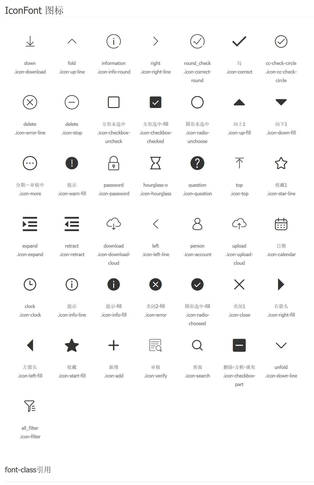
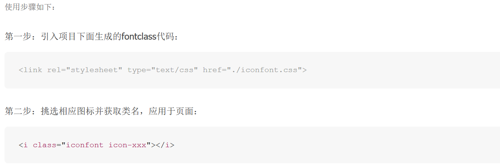

# t-component dev-kit 介绍文档


本套脚手架是基于vue并内含一套定制的UI组件和页面demo的开发脚手架。

- [t-component dev-kit 介绍文档](#t-component-dev-kit-介绍文档)
    - [基本使用](#基本使用)
    - [组件使用方法介绍](#组件使用方法介绍)
    - [组件API及使用介绍](#组件api及使用介绍)        
      - [1. backtop / 回到顶部](#1-backtop--回到顶部)        
      - [2. badge / 标记](#2-badge--标记)        
      - [3. button / 按钮](#3-button--按钮)        
      - [4. cascader / 级联选择](#4-cascader--级联选择)        
      - [5. checkbox / 多选框](#5-checkbox--多选框)        
      - [6. CheckboxGroup / 多选框组](#6-checkboxgroup--多选框组)        
      - [7. datepicker / 日期选择器](#7-datepicker--日期选择器)        
      - [8. input / 输入框](#8-input--输入框)        
      - [9. loading / 加载中](#9-loading--加载中)        
      - [10. menu / 菜单](#10-menu--菜单)        
      - [11. messagebox / 对话框](#11-messagebox--对话框)        
      - [12. modal / 模态框](#12-modal--模态框)        
      - [13.Notify / 通知](#13notify--通知)        
      - [14. pagination / 分页导航](#14-pagination--分页导航)        
      - [15. progress / 进度条](#15-progress--进度条)        
      - [16. radio / 单选框](#16-radio--单选框)        
      - [17. select / 选择框](#17-select--选择框)        
      - [18. step / 步骤条](#18-step--步骤条)        
      - [19. switch / 开关](#19-switch--开关)        
      - [20. table / 表格](#20-table--表格)        
      - [21. timepicker / 时间选择器](#21-timepicker--时间选择器)        
      - [22. tooltip / 气泡提示框](#22-tooltip--气泡提示框)        
      - [23. transfer / 穿梭框](#23-transfer--穿梭框)        
      - [24. tree / 树形选择](#24-tree--树形选择)        
      - [25. upload / 上传](#25-upload--上传)    
      - [26. breadcrumb / 面包屑导航](#26-breadcrumb--面包屑导航)
      - [27. empty / 暂无数据](#27-empty--暂无数据)
      - [28. card / 卡片](#28-card--卡片)
      - [29.affix / 固钉](#29-affix--固钉)
      - [30.list / 列表](#30-list--列表)
      - [31.form / 表单](#31-form--表单)
     - [iconfont类名图例](#iconfont类名图例)

## 基本使用

使用步骤：
1、安装依赖。

```JavaScript
npm install
```

2、运行开发模式。

```JavaScript
npm run dev
```

3、打开接口和上传模拟服务器。默认端口为3000

```JavaScript
npm run mock
```

4、进行生产环境打包。

```JavaScript
npm run build
```

5、运行业务场景实例系统的开发模式

```JavaScript
npm run dev-demo
```

6、运行业务场景实例系统的打包，会自动打包到`/demo/bin`文件夹内容，为业务场景系统的前端内容

```JavaScript
npm run dev-demo
```

5、运行业务场景实例系统。默认端口为3001

```JavaScript
npm run demo
```

## 组件使用方法介绍

组件合集中包含了20个单文件组件，4个函数式组件。常用的单文件组件包括 button、input、radio、model、select、checkbox和tooltip，已经在Vue中全局注册，直接在页面中使用即可；函数式组件已经安装在全局Vue中，直接调用即可；其他组件则可以按需引入到页面中使用。

> 示例1  myApp.vue

```HTML
<template>
  <div>
    <t-button @click="showLoading">这是一个按钮。</t-button>
    <!--内置组件，可以直接调用-->
    <Datepicker placeholder="请输入出生日期" v-model="birthday"/>
  </div>
</template>
<script>
import { Datepicker } from 't-component';
// 按需引用组件到页面中去，直接从't-component'引用即可
export default{
  name: 'myApp',
  data(){
    return { birthday: '' };
  },
  components: { Datepicker }， // 外部引用的组件需要注册
  methods: {
    showLoading() {
      this.$loading.open('数据加载中')；
      // 函数式组件可以直接调用
    },
}
</script>
```

## 组件API及使用介绍

### 1. backtop / 回到顶部

简介：返回页面顶部的操作按钮。

使用场景：页面内容区域比较长，用户又需要频繁返回顶部查看相关内容时。

引用

```JavaScript
import { Backtop } from 't-component';
```

属性

| 属性名      | 说明    |  类型 |默认值|可选值|
| --------- | -------- | -----: | --: |--: |
|showHeight|设定页面滚动多少高度之后在显示backtop按钮|`Number`|`300`|
|position|设定backtop按钮显示的位置|`Object`|`{ bottom: '40px', right: '40px' }`|
|duration|设定点击backtop按钮之后多久回到页面顶部|`Number`|`500`|

### 2. badge / 角标

简介：图标或者文字右上角的圆形标或带有数字的圆形标。

使用场景：用在通知、消息图标、头像、某些特殊文字的右上角，显示需要处理的信息条数，通过醒目的视觉形式来吸引用户处理。

引用

```JavaScript
import { Badge } from 't-component';
```

属性

| 属性名      | 说明    |  类型 |默认值|可选值|
| --------- | -------- | -----: | --: |--: |
|type|设置标记显示的类型（带文字/不带文字）|`String`|`dot`|`dot text`
|isShow|设置是否显示标记|`Boolean`|`true`|`true false`|
|color|设置标记的颜色,支持Hex和RGB写法|`String`|`#f24a4a`|    |
|textColor|设置文字颜色，写法同上| `String` |  `#fff`   |    |
|content|设置标记的文字内容|   `String`     |     |    |

插槽

| 插槽名      | 说明    |
| --------- | -------- |
|-|    设置标记的文字内容      |

### 3. button / 按钮

简介：触发一个即时动作的操作按钮。

使用场景：当需要响应用户点击行为，触发相应的业务逻辑时，标记一个或封装一组操作命令。

引用

```HTML
<t-button>按钮1</t-button><!--已在vue中注册可以直接使用-->
```

属性

| 属性名      | 说明    |  类型 |默认值|可选值|
| --------- | -------- | -----: | --: |--: |
| size | 设置按钮的大小 | `String` | `'normal'` | `'large'`, `'normal'`, `'small'`|
| type | 设置按钮的颜色类型 | `String` | `'default'` | `'default'` `'primary'` `'success'` `'warning’` `'danger'` `'info'` `'text'` |
| disable| 设置是否禁用按钮 | `Boolean` | `false` | `true false` |
| shape | 设置按钮的形状 | `String` | `default` | `'default'` `'circle'`  `'ellipse'`|
| icon  | 按钮图标类名  | `String`    |     |   见《icon详细目录》  |

==备注==： size和type这两个属性使用的是预设的值，如果有特殊需要可以另外设置样式，例如直接在其标签添加行内样式`style="width:100%; color: red;"`也是可以的，后面有类似的属性默认也是这样的。

### 4. cascader / 级联选择

简介：级联选择框。

使用场景：当用户需要从一组相关联的数据集合中进行选择时，或在一个较大的数据集合中进行选择时，用多级分类进行分隔，方便选择。如省市区、公司组织架构通讯录、事物级联分类等，和 Select 选择相比，用户可以在同一个浮层中完成所需的所有选择，会有较好的用户体验。

引用

```JavaScript
import { Cascader } from 't-component';
```

属性

| 属性名      | 说明    |  类型 |默认值|可选值|
| --------- | -------- | -----: | --: |--: |
|options| 设置供选择的数据项  |`Array`|     |     |
| value  |绑定`v-model`的值|  `Array`   |     |     |
|placeholder| 设置输入框占位文本  |  `String`   |     |     |
|multiple | 设置是否可以选做个选项  |`Boolean`|`true`| `true` `false` |
| disable  |设置是否禁用级联选择|`Boolean`|`false`|`true false`|
| clearable |设置是否可清空数据|`Boolean`|`true`|`true false`|
|loadData|设置动态加载选项|`Function`     |     |
|displayMethod|设置显示的格式|`Funtion/String`|  `label`   |     |
| popupPlacement  | 设置浮层位置  |`String`     |  `'bottomLeft'`   |  `'bottomLeft'` `'bottomRight'` `'topLeft'` `'topRight'`   |
|anyState| 是否允许选择任意一级的选项  |  `boolean`   |  `false`   |  `true false`   |

==备注==:

1. displayMethod属性为输入字符串的时候渲染对应字符串的数据字段，方法则用于某些复杂显示的数据字段的业务场景。
2. 设置多选时，最后一级要传数组，eg: [{一级}，{二级}, [{三级}，{三级}]]

  事件

| 事件名称 | 说明 | 返回值 |
| --- | --- |---|
|change| 选择值变化后触发的事件 | 返回value值 |
|choose|当某一级菜单被点击后触发的事件|各父级选项组成的数组 |

### 5. checkbox / 多选框

简介：多项选择框。

使用场景：当用户需要在一组可选项中进行多项选择时。如果单独使用则表示两种状态之间的切换，和 switch 类似，但也有区别，区别在于切换 switch 会直接触发状态改变，但 checkbox 一般仅用于状态标记，需要和提交操作配合使用。

引用

```HTML
<t-checkbox value="1" v-model="check"></t-checkbox ><!--已在vue中注册可以直接使用-->
```

属性

| 属性名      | 说明    |  类型 |默认值|可选值|
| --------- | -------- | -----: | --: |--: |
| value  |设置多选框代表的值,如果是字符串或者数字会在没有包裹内容的时候自动显示出来|  `All`   |     |     |
|checked| 多选框是否被选，使用`v-model`的时候不用绑定这个 |   `Boolean Array`  |     |     |
| disable  |是否禁用多选框|`Boolean`|`false`|`true` `false`|
|      showLabel     |  设置是否自动显示value作为多选框的标签值     |   `Boolean`     |  根据`value`值的类型而定，如果为数字和字符串的话，则自动显示   | `true false`   |
|     displayMethod      |  当绑定的value为对象时，自定义设置显示的方法，参数为value的值        |  `Function`      |     |    |
|objKeyValue|    当value值为对象且处于多选的时候，用于检查唯一性的属性名     |    `String`     |  `'value'`   |    |
| halfCheck  | 在作为checkgroup的全选按钮的时候，用于设置是否显示非全选的图标    |  `Boolean`      |  `false`    |   `true false`   |

==备注==：

1. checked属性/v-mode可以绑定布尔值或者数组（和vue实现的原生checkbox的绑定一样），绑定布尔值就对应着多选框是否被选择（true: 被选/ false: 没选）；绑定数组则对应多选框的值是否存在于选择集合里面。
2. displayMethod属性适用于当value绑定的值为对象的时候的定制化显示的选项内容的业务场景，当然也可以使用插槽来实现相同效果。

  事件

| 事件名称 | 说明 | 返回值 |
| --- | --- |---|
|change| 多选框值变化触发的事件 | 是否被选中 => `true` /`false`，`true`的话还会返回对应`value`值,`false`的时候会返回`null`|

插槽

| 插槽名      | 说明    |
| --------- | -------- |
|-|    设置多选框的选项显示内容      |

### 6. CheckboxGroup / 多选框组

简介：同checkbox。

使用场景：同checkbox。

引用

```JavaScript
import { CheckboxGroup } from 't-component';
```

属性

| 属性名      | 说明    |  类型 |默认值|可选值|
| --------- | -------- | -----: | --: |--: |
|value | 多选框在组件里绑定`v-model`的值 |     |     |     |
| disable  |是否禁用多选框组|`Boolean`|`false`|`true false`|
|max|多选框组最多可选的选项数量|`Number`|     |     |
|min| 多选框组最少可选的选项数量  |  `Number`   |     |     |

==备注==： checkboxGroup返回为数组

事件

| 事件名称 | 说明 | 返回值 |
| --- | --- |---|
|change| 多选框组值变化触发的事件 | 返回变化之后的数组值 |

### 7. datepicker / 日期选择器

简介：输入或者选择日期。

使用场景：当用户需要输入一个日期，或点击输入框，需要弹出日期面板进行日期选择时。

引用

```JavaScript
import { Datepicker } from 't-component';
```

属性

| 属性名      | 说明    |  类型 |默认值|可选值|
| --------- | -------- | -----: | --: |--: |
| value | 设置绑定时间的值，绑定`v-model`的时候不需要绑定此属性  |  `String|Date Object` |     |     |
|type| 设置选择器的功能,可以选择日期、月份、年份和日期范围|`String`   |  `date`   | `date month year week dateRange`    |
| format  |显示格式|`String`|  `yyyy-MM-dd`   |     |
|disabledDate|设置不可选择的日期|    `Function`    |     |    |
|rangePlaceholder|   type为dateRange的时候输入框的placeholder|  `Array`      |  `['开始时间', '结束时间']`|    |
|placeholder|type为year、month、date的时候输入框的placeholder|`String`|`'选择日期'`|    |


==备注==：disableDate属性方法会返回一个Date对象作为参数，disableDate方法则需要返回一个布尔值以表示传入的日期是否在不可选择的日期范围内。
示例：(单纯的函数示例)

```JavaScript
function disabledDate(date) {
  return date < new Date('2018-10-3') || date > new Date('2019-1-3'); }
```

### 8. input / 输入框

简介：最基础的表单域，通过鼠标或键盘输入内容。

使用场景：需要用户输入表单域内容时。

引用

```HTML
<t-input v-model="check"></t-input><!--已在vue中注册可以直接使用-->
```

属性

| 属性名      | 说明    |  类型 |默认值|可选值|
| --------- | -------- | -----: | --: |--: |
| value  |设置输入框的值，当使用v-model绑定的时候，不需要绑定这个属性|  `String` `Number`   |     |     |
|type|设置输入框的类型|`String`|`text`|`text` `password` `number` `textarea`|
| size | 设置输入框的大小 | `String` | `'normal'` | `'large'`, `'normal'`, `'small'`|
| readonly  |设置原生的readonly属性|`Boolean`|`false`|`true` `false`|
|disable|设置输入框是否可用|`Boolean`|`false`|`true` `false`|
|validate|设置验证输入框内容使用的函数或正则表达式|`Function/RegExp`|     |     |
|errorMessage| 验证出现报错信息的设置|`Object/String`| ||
| placeholder|设置占位文本|`String`|     |     |
|clearable| 设置是否显示清除按钮  |`Boolean`|`false`|`true` `false`|
|autofocus|设置自动获取焦点|`Boolean`|`false`|`true` `false`|
|autocomplete|原生属性自动补全|`Boolean`|`false`|`true` `false`|
| rows  |仅在`type="textarea"`时生效，输入框的行数| `Number`|||
|cols| 仅在`type="textarea"`时生效，输入框的列数  | `Number`|||
|max|仅在`type="number"`时生效，输入数字的最大值|`Number`|  ||
|min|仅在`type="number"`时生效，输入数字的最小值|`Number`|  ||
|maxLength|原生属性，输入字符串的最大长度|`Number`  |    |     |

==备注==：errorMessage为字符串的时候，默认为错误显示的文字内容，而为对象的时候的结构应为：

```JavaScript
{
  errorText: '', // 错误显示的文字内容
  errorColor： '', // 错误显示的文字的颜色
}
```

事件

| 事件名称 | 说明 | 返回值 |
| --- | --- |---|
|change| 输入框值变化触发的事件 | 返回value值 |
|keyup|  输入框按键完毕触发的事件  | 返回输入的值 |
|focus|选择框获得焦点的时候触发|   |
|blur|选择框失去焦点的时候触发|   |
|enter|  按enter键的时候触发   |   |

插槽

| 插槽名| 说明 |
|---|---|
|leftIcon| 出现输入框内部左边的icon  |
|rightIcon|出现在输入框内部右边的icon|
|leftLabel|出现在输入框外部左边的附加内容|
|rightLabel|出现输入框外边右边的附加内容|

### 9. loading / 加载中

简介：表达页面或区块数据的正处于加载中的状态。

使用场景：当页面局部处于等待异步数据或正在渲染过程中时，给用户展示合适的加载动效，可以有效缓解用户的焦虑。

引用

```JavaScript
this.$loading.open('加载中'); // 已集成到vue中，可以直接调用其方法
this.$loading.open('获取数据中', 'stripper');
this.$loading.open('努力加载中', 'ballRing', 3);
this.$loading.config({
  title: '加载中...',
  icon: 'walkingSquare',
  duration: 5,
  backdrop: true,
  backdropColor: '#f2f2f2',
}).open();
this.$loading.close();
```

方法及参数

`this.$loading.open([title, icon, duration])`

|参数名|说明|类型|可选值
|---|---|---|---|
|title|可选，设置加载提示的文字内容 | `String`  |
|icon|可选，设置加载的动画类型   | `String`  | `'win8' 'ballqueue' 'circle3' 'walkSquare' 'ballring' 'stripper'`
| duration  | 可选，设置多少秒之后自动消失  | `Number`  |   |

`this.$loading.config(config)`

|参数名|说明|类型|可选值
|---|---|---|---|
|config|必填，用于设置加载提示详细配置的对象|`Object`|   |

config的应有的几个属性名：

```JavaScript
const config = {
  title: '', // String，加载提示的文字
  icon: '', // String，加载提示的动画图标类型
  duration: 3, // Number，(单位：s)加载提示的加载时间，即多少秒之后自动消失
  backdrop: false, // Boolean, 是否显示背后遮罩层
  backdropColor: '#fff', // String, 遮罩层的颜色
  customTpl: '<span>自定义HTML模板</span>', // String, 自定义的HTML模板
}
```

==备注==：

1. config()方法需要继续调用open()才能够是加载提示显示出来；
2. duration属性选项如果不配置的话，加载提示不会自动消失，必须调用close()，加载提示才能消失;
3. backdrop即使设置为不显示也点击不了其他内容，目的是为了防止用户误触；
4. 如果设置了customTpl属性选项，则title和icon选项则不会生效。

`this.$loading.close()`

手动关闭加载提示。

### 10. menu / 菜单

简介：导航菜单，为页面和功能提供导航的菜单列表。

使用场景：导航菜单是一个软件的灵魂，为用户提供在各个页面间进行跳转的导航。有顶部导航和侧边导航，顶部导航提供全局性的类目和功能，侧边导航提供多级结构来收纳和排列软件的页面架构。

引用

> mymenu.vue;

```HTML
<template>
<Menu direction="vertical">
  <MenuItem menuName="菜单0" link="/"></MenuItem><!--MenuItem只能嵌套在Menu或者SubMenu中使用-->
  <SubMenu menuName="菜单1"><!--SubMenu中可以嵌套自身和MenuItem-->
    <MenuItem menuName="副菜单1"link="/1"></MenuItem>
    <MenuItem menuName="副菜单2" link="/2"></MenuItem>
  </SubMenu>
</Menu>
</template>
<script>
import { Menu , MenuItem, SubMenu } from 't-component'; // 建议menu组件换用其他别名，防止eslint报错
export default{
  name: 'my-menu';
  components: { 't-menu': Menu, MenuItem, SubMenu },
}
</script>
```

==备注==：一个菜单需要菜单组件Menu、副菜单SubMenu和菜单项MenuItem来组合而成，其中Menu和MnuItem是必要的组成部分，而SubMenu则是在有子菜单的情况下选用。菜单的层级没有限制，但是从用户体验上出发，最多不超过三层，太复杂对于导航不友好。

Menu组件属性

| 属性名      | 说明    |  类型 |默认值|可选值|
| --------- | -------- | -----: | --: |--: |
|direction | 设置菜单的显示方向  |  `String`   | `'horizontal'`    | `'horizontal' 'vertical'`    |
| routerHandler|  自定义路由的跳转方法 |  `Boolean`   |  `false`   | `true false`    |
|canCollapse|  设置菜单是否可以展开/收缩，仅在`'vertical'`模式下有效|`Boolean` |`false` | `true false`    |
|collapse |  设置菜单在第一次渲染为展开(true)/收缩(false)状态 ，仅在canCollapse为`true`有效   | `Boolean` |`false` | `true false`    |
|textColor|    默认的文字颜色      |   `String`     |   `'#333'`  |    |
|bgColor|    默认的背景颜色      |    `String`    |  `'#fff'`   |    |
|activeTextColor|   选中的项的文字颜色       |   `String`     |  `'#4385ff'`   |    |
|activeBgColor|    选中的项的背景颜色      |    `String`    |  `'#d5e5ff'`   |    |
|value|  用于v-model绑定，为当前显示的menu的名字        |`String`      |     |    |

==备注==：在MenuItem中设置了link属性的的时候才会激发路由跳转的功能，才能使Menu中的routerHandler属性发挥作用，routerHandler接受参数是被点击的MenuItem的link属性的路由路径信息。

SubMenu组件属性

| 属性名      | 说明    |  类型 |默认值|可选值|
| --------- | -------- | -----: | --: |--: |
|icon| 设置子菜单要显示的图标  | `String`    |     |  iconfont内的图标类名   |
|disable| 设置子菜单是否可用  |   `Boolean`   |  `false`   | `true false`    |
| menuName| 设置子菜单要显示的标题  | `String`    |     |     |

==备注==：SubMenu组件没有link属性，因为它不担任跳转功能，它只负责展示/隐藏子菜单。

SubMenu组件插槽

| 名称 | 说明 |
|---|---|
|icon| 自定义子菜单的图标  |

MenuItem组件属性

| 属性名      | 说明    |  类型 |默认值|可选值|
| --------- | -------- | -----: | --: |--: |
|link|  设置菜单项要跳转的路由地址或对象 |  `String|Object`   |     |     |
|disable| 设置菜单项是否可用  |  `Boolean`   |  `false`   | `true false`    |
|icon|  设置菜单项要显示的图标 |  `String`   |     | iconfont内的图标类名    |
|menuName| 设置子菜单要显示的标题  |  `String`   |     |     |

MenuItem组件插槽

| 名称 | 说明 |
|---|---|
|icon| 自定义菜单项的图标  |

### 11. messagebox / 对话框

简介：展示操作反馈信息的提示框。

使用场景：当用户进行某些操作时，需要给用户以不同的反馈提示信息。

引用

```JavaScript
this.$messagebox.alert('', '不能关闭此页面') // 已集成到vue中，可以直接调用其方法
this.$messagebox.confirm('警告'，'确定要删除此页面吗？', 'icon-warn-fill').then((result) => {
    console.log(result);
    // do something else
  })
  .catch((result) => {
    // do something else
  })
this.$messagebox.prompt('提示'，'请输入你的年龄').then((result) => {
    console.log(result);
    // do something else
  })
  .catch((result) => {
    // do something else
  })
this.$messagebox({
  title: '这是小标题',
  buttonText: ['对的', '错的'],
  type: 'prompt',
  inputValidate: /[0-9]/,
  errorMessage: '请输入数字'
}, (result) => {
  console.log(result);
})
```

方法及参数

`this.$messagebox.alert([title, text, icon, buttonText])`
`this.$messagebox.confirm([title, text, icon, buttonText])`
`this.$messagebox.prompt([title, text, icon, buttonText])`

|参数名|说明|类型|可选值
|---|---|---|---|
|title|可选，设置对话框的标题内容，不设置则为空 | `String`  |
|text|可选，设置对话框的文字内容，不设置则为空| `String`  |   |
|icon|可选，设置对话框的标题图标类型   | `String`  | iconfont里类名
| buttonText| 可选，设置对话框的按钮文字内容，最多两个，默认为`['确定', '取消']`  | `Array`  |   |

==备注==：这几个函数均为异步的Promise函数，可以根据用户的选择做出相应的动作。

`this.$messagebox(config, callback)`

|参数名|说明|类型|可选值
|---|---|---|---|
|config|必填，用于设置对话框详细配置的对象|`Object`|   |
|callback|可选，用户点击按钮的执行的回调方法|`Function` |   |

config应有的几个属性名：

```JavaScript
const config = {
  title: '', // String, 设置对话框的标题内容
  text: '', // String, 设置对话框的文字内容
  icon: '', // String, 设置对话框的标题图标类型
  iconColor: '', // String, 设置对话框的标题图标颜色
  inputValidate: null, // Function|RegExp, 用于验证prompt的用户输入内容，仅在type为prompt时生效
  customTpl: '', // String， 设置自定义的HTML模板，此属性会覆盖其他关于外观的设置
  type: '', // String，设置对话框的类型，可选值有'alert', 'confirm'和'prompt'
  theme: '', // String，设置对话框的图标主题(即类型和颜色),可选值  
  // 有'info','warnning','error'和'success'
  buttonText: ['确定', '取消'], // 设置对话框的按钮文字
  buttonClass: ['t-msgbox-confirmBtn', 't-msgbox-cancelBtn'], // 设置对话框的按钮的样式
  canClose: true, // 是否显示关闭按钮
  onClose: null, // 关闭之后的回调函数
  backdrop: true, // 是否显示遮罩层
  backdropColor: '#767676', // 设置遮罩层的颜色
}
```

==备注==：在填入callback参数之后，就不会在返回promise对象了。

### 12. modal / 模态框

简介：模态对话框。

使用场景：需要用户处理事务，但又不希望跳转页面以致打断工作流程时，或需要询问用户的确认时。使用 modal在当前页面中打开一个浮层，来承载相应的操作。

引用

```HTML
<t-modal v-model="showModal">
  <div slot="header">这个是一个自定义的模态框</div>
  <div slot="body">
    它啥都可以装的下，满足你所有定制需求  
  </div>
  <div slot="footer">  
    <Button type="primary" style="float: right;">确定</Button>
    <Button style="float: right;margin-right: 15px;">取消</Button>
  </div>
</t-modal><!--已在vue中注册可以直接使用-->
```

属性

| 属性名  |  说明  | 类型 | 默认值 | 可选值
|---|---| --- | --- | --- |
| canClose| 设置模态框是否显示关闭按钮 | `Boolean`   |  `true`   | `true false`    |
|value|模态框是否显示，当绑定v-model时不用使用绑定此属性| `Boolean`   | |   |
|onClose|用户点击关闭按钮的回调事件| `Function`    |     |     |
|backdrop| 设置是否显示遮罩层  | `Boolean`   |  `true`   | `true false`    |
|backdropColor| 设置遮罩层颜色  |   `String`  |  `'#767676'`   |     |
|closeOnClickModal| 是否通过点击遮罩关闭  |   `Boolean`  |  `true`   |   `true false`    |

插槽

| 名称 | 说明 |
|---|---|
|header|设置模态框的头部内容|
|body|设置模态框的主体内容|
|footer|设置模态框的底部内容|

### 13.Notify / 通知

简介：通知提醒信息。

使用场景：系统主动推送的系统消息，具有复杂内容的通知，或带有交互的通知，给用户下一步的行动引导。

引用

```JavaScript
this.$notify.info('这是一条提示', '没有具体的内容', 3);
this.$notify.error('这是一条警告', '', 3);
this.$notify.success('这是一条提示', '', 3).onclick(() => {
  // do something while click
);
this.$notify.warning({
  title： '你好',
  text: '请先登录！'
  position： 'bottomLeft',
  duration: 3
});
this.$notify.config({
  customTpl: '<span>自定义的通知提示</span>'
  onClick() {
    // do something while click
  },
  onClose() {
    // do something while close
  },
}).open();

```

方法及参数

`this.$notify.info([title, text, duration])`
`this.$notify.error([title, text, duration])`
`this.$notify.success([title, text, duration])`
`this.$notify.warning([title, text, duration])`

|参数名|说明|类型|可选值
|---|---|---|---|
|title|通知提示的标题| `String`  |   |
|text|通知提示的文字内容| `String`  |   |
| duration  | 通知提示的显示持续时间  | `Number`  |   |

`this.$notify.config(config).open()`

|参数名|说明|类型|可选值
|---|---|---|---|
|config|必填，用于设置通知提示详细配置的对象|`Object`|   |

config应有的几个属性名：

```JavaScript
const config = {
  title: '', // String, 设置通知提示的标题内容
  text: '', // String, 设置通知提示的文字内容
  icon: '', // String, 设置通知提示的标题图标类型
  customTpl: '', // String， 设置自定义的HTML模板，此属性会覆盖其他关于外观的设置
  theme: '', // String，设置通知提示的图标主题(即类型和颜色),可选值  
  // 有'info','warnning','error'和'success'
autoDimiss: 'true',//Boolean,设置是否自动关闭
position: 'topCenter' 自定义位置('topRight','topLeft','bottomRight','bottomLeft','topCenter','bottomCenter' ,自定义位置(例:'{ top: '400px', left: '50%' }'))
  onClose: null, // 关闭之后的回调函数
  onClick: null, // 关闭之后的回调函数
  backdrop: true, // 是否显示遮罩层
  backdropColor: '#767676', // 设置遮罩层的颜色
}
```

`this.$notify.onclick(callback);`
`this.$notify.onclose(callback);`

|参数名|说明|类型|可选值
|---|---|---|---|
|callback|必填，用于设置相关动作的回调函数|`Object`|   |

==备注==：
此处链式调用的搭配有某些局限性。
info/warning/error/success等函数不建议和config以及open连用：

1. 和config连用会把原本设置覆盖掉 ；
2. 和open连用会没有反应 ；

onclick和onclose这两个函数则不存在这个局限。
不过如果链在config函数后面会有可能吧config里的对应属性给覆盖掉，使用的时候应注意。

### 14. pagination / 分页导航

简介：对长列表进行分页，每次只加载一个页码的数据。

使用场景：加载或渲染长列表所有数据时，通过切换页码来加载或渲染数据，可大大缩短加数据载或渲染的时间。

引用

```JavaScript
import { Pagination } from 't-component';
```

属性

| 属性名  |  说明  | 类型 | 默认值 | 可选值
|---|---| --- | --- | --- |
|total| 一共的总条数  |  `Number`   |   `0`  |     |
| showPagesize  |  是否显示可更改每页条数的选项 | `Boolean`   |  `false`   | `true false`    |
|showTotal| 是否显示总条数  |  `Boolean`   |  `false`   | `true false`    |
|showElevator|  是否显示直达跳转的选项 |  `Boolean`   |  `false`   | `true false`    |
|showPageTab|  是否显示首页尾页按钮 |  `Boolean`   |  `false`   | `true false`    |
|currentPage|当前所在的页数|  `Number`   |   `1`  |     |
|pageSize| 设置每页显示的条目数  |   `Number`   |  `10`   |     |

==备注==：currentPage为双向绑定值，需要用到 `.sync`后缀

 事件

| 事件名称 | 说明 | 返回值 |
| --- | --- |---|
|sizeChange| pageSize改变时触发的事件  |  改变之后的条目数   
|  pageChange | pageNo改变时触发的事件  |  改变之后的当前页数  

### 15. progress / 进度条

简介：当前的操作进度展示。

使用场景：在操作需要较长时间才能完成时，显示该操作的当前进度和状态。如一个操作会打断当前界面，或者需要在后台运行，且耗时可能超过2-5秒时，展示一个操作完成情况的百分比时等。

引用

```JavaScript
import { Progress } from 't-component';
```

属性

| 属性名  |  说明  | 类型 | 默认值 | 可选值
|---|---| --- | --- | --- |
|percent| 绑定进度条的百分比   | `Number`    |  `0`  |`0-100`
|  type | 设置进度条类型  |   `String`  |  `line`   |   `'line' 'circle'`  |
|  color|设置进度条颜色|`String/Object`|     |     |
| status | 设置进度条的状态  |     |   `'uploading'`  |   `'success'` `'exception'` `'active'`  |
| strokeWidth | 进度条的宽度  |   `Number`  |  `10`   |     |
| showInfo  | 是否显示进度数值或状态图标  |   `Boolean`  |`true`|  `true false`   |

==备注==: color输入字段为字符串的时候会进度条的颜色左右状态的颜色都改成对应颜色，而输入字段为对象，且为类似于`{success：'color1',exception: 'color2', active: 'color3'}`则可以分别定制三种状态的颜色。


### 16. radio / 单选框

简介：单选框。

使用场景：在多个备选项中选中单个状态时，但radio和 Select 是有区别的，Radio 的所有选项是可见的，方便用户在比较中进行选择，所以适用于选项不宜过多时。

引用

```HTML
<t-radio label="1" v-model="check"></t-radio><!--已在vue中注册可以直接使用-->
```

属性

| 属性名  |  说明  | 类型 | 默认值 | 可选值
|---|---| --- | --- | --- |
| label  |单选框代表的值,如果是字符串或者数字会在没有包裹内容的时候自动显示出来|  `Boolean|Number|String`   |     |     |
|checked| 单选框是否被选择，若在组件里绑定`v-model`的值，不需要再绑定   |     |     |     |
| disable  |是否禁用单选框|`Boolean`|`false`|`true` `false`|

==备注==： radio不需要原生name值来确保多个radio在同一组内。多个radio的v-model绑定同一个值即可以达到这个效果。

 事件

| 事件名称 | 说明 | 返回值 |
| --- | --- |---|
|change| 单选框值变化触发的事件 | 是否被选中 => `true` /`false`，`true`的话还会返回对应`value`值,`false`的时候会返回`null`|

### 17. select / 选择框

简介：下拉选择器。

使用场景：当选项多于 5 项时，弹出一个下拉菜单给用户作选择，用于代替原生的选择器。

引用

```HTML
<t-select  value="1" v-model="check"></t-select><!--已在vue中注册可以直接使用-->
```

属性

| 属性名  |  说明  | 类型 | 默认值 | 可选值
|---|---| --- | --- | --- |
|multiple | 是否可以多选  |`Boolean`|`true`| `true` `false` |
|disable|是否禁用|`Boolean`| `false`   | `true` `false`    |
| canInput|是否可以输入|`Boolean`|`false`|`true` `false`|
|value|选中的项，若已绑定v-model，则不需要绑定此属性|  `Array` |   |     |
| filterMethod  |用于筛选搜索选项的自定义函数| `Function` |`(item,str) => {return item.indexOf(str) > -1 }`|     |
|placeholder|输入框默认显示的文本| `String` |     |     |
|options|所要渲染的选项组,默认渲染字段为`label`| `Array`   |     |     |
|displayMethod|所要显示的字段或者显示的方法|`String|Funcion`|     |     |

==备注==： canInput属性应用于某些需要搜索选项或者提供搜索结果的业务场景中。

事件

| 事件名称 | 说明 | 返回值 |
| --- | --- |---|
|change| 选择框值变化触发的事件 | 返回变化之后的数组值 |
|keyup|  在启用了`canInput`且用户打字的时候触发，适合用于调用某些搜索类型函数  | 返回输入的值 |
|focus|选择框获得焦点的时候触发|   |
|blur|选择框失去焦点的时候触发|   |

### 18. step / 步骤条

简介：引导用户按照某种流程完成任务的导航条。

使用场景：当任务有较复杂的流程，或流程间存在先后关系时，将这些分解成一系列的步骤，展示给用户，即可简化任务，又可以给用户以很清晰的提示。

引用

> mystep.vue;

```HTML
<template>
<div>
  <steps :active="stepCount" :status="activeStatus2" direction="vertical">
    <step>
     <span slot="title">第一步</span>
     <p slot="description" style="text-align:left;">首先要打开冰箱门8888</p>
    </step>
    <step :showNumber="false">
     <p slot="title" >第二步</p>
    </step>
    <step :showNumber="false">
      <p slot="title" >第三步</p>
    </step>
    <step :showNumber="false">
      <p slot="title" >第四步</p>
    </step>
  </steps>
 </div>
</template>
<script>
import { Steps, Step } from 't-component';
export default{
  name: 'my-step';
  data(){
    return {
      stepCount: 0,
      activeStatus2: 'processing',
    },
  },
  components: { Steps, Step },
}
</script>
```

==备注==：steps组件和step组件必须搭配一起才能正常使用，另外steps组件最好外面包裹一层容器来调整宽度，因为steps组件会自动撑满父容器然后让step组件计算每一项的宽度。

Steps组件属性

| 属性名  |  说明  | 类型 | 默认值 | 可选值
|---|---| --- | --- | --- |
| direction |  设置进度条显示的方向 | `String`   | `'horizontal'`    |  `'horizontal' 'vertical'`   |
| active  |当前激活的步骤,从0开始算起|  `Number`   |     |     |
| status  |当前的状态|`String`|`'process'`| `'process' 'success' 'error'`    |
|useNumber|  设置是否用数字代替进度图标 |     |     |     |
|  iconProcess | 处理中进度的图标  |  `String`   |  `'icon-hourglass'`   |   iconfont的图标类名  |
|iconWait| 等待中的进度图标  |  `String`   |  `'icon-more'`   |  iconfont的图标类名   |
|iconSuccess| 成功的进度图标  |  `String`   |  `'icon-cc-check-circle'`   |  iconfont的图标类名   |
|iconFail| 失败的进度图标  |   `String`  |  `'icon-error-line'`   |  iconfont的图标类名   |
|iconColor| 设置进度条图标的颜色 |   `Array`   |  `['#4385ff', '#969696', '#4acd1f', '#f24a4a']`   |     |

Step组件属性

| 属性名  |  说明  | 类型 | 默认值 | 可选值
|---|---| --- | --- | --- |
|title | 进度步骤显示的文字标题内容  |  `String`   |     |     |
| description| 进度步骤显示的描述性内容  |  `String`   |     |     |
| icon| 进度步骤显示的图标或者图片  |`String`|     |     |

 插槽

| 名称 | 说明 |
|---|---|
|title| 进度步骤的标题内容|
|description | 进度步骤描的述文字内容  |

### 19. switch / 开关

简介：开关选择器。

使用场景：需要表示开关状态或两种状态之间的切换时。和checkbox的区别：切换 switch 会直接触发状态的改变， checkbox 用于状态标记，需要和提交操作配合。

引用

```JavaScript
import { Switch } from 't-component';
```

属性

| 属性名  |  说明  | 类型 | 默认值 | 可选值
|---|---| --- | --- | --- |
|value|设置开关绑定的值，当绑定v-model是不用绑定这个属性值|`Boolean|Number|String`|  `false`  |     |
|disable|设置是否禁用按钮|`Boolean`|`false`|`false`  `true`|
|type| 设置开关的颜色类型  | `String` |`default`|  `'default'` `'primary'` `'success'` `'warning’` `'danger'` |
|size|开关的大小|`String`|`normal`|  `'large'` `'normal'` `'small'`  |
|activeValue| 开关激活时绑定的值  | `Boolean|Number|String`   |   `false`  |     |
|inactiveValue| 开关未激活是绑定的值  |  `Boolean|Number|String` |  `false`   |     |

 事件

| 事件名称 | 说明 | 返回值 |
| --- | --- |---|
|change| 开关切换时触发的事件 | 开/关 => activeValue绑定的值 / inactiveValue绑定的值

插槽

| 名称 | 说明 |
| --- | --- |
|openText| 自定义显示打开时的内容 （显示在内部）   |
|closeText| 自定义显示关闭时的内容 （显示在内部）   |

### 20. table / 表格

简介：数据的行列展示方式。

使用场景：需要展示大量结构化数据时，需要对数据进行排序、搜索、分页等复杂行为时。

引用

> mytable.vue;

```HTML
<template>
  <div>
   <Table :source="tableData"
    :hasSummary="true"
    :summaryKeys="['zip']"
    :onClick="ialert"
    height="300px"
    width="800px"
    >
     <TableColumn type="selection" ></TableColumn>
     <TableColumn type="index" ></TableColumn>
     <TableColumn colKey="name" label="姓名" ></TableColumn>
     <TableColumn colKey="date" label="时间" ></TableColumn>
     <TableColumn colKey="address" label="地址" :nowp="true"></TableColumn>
     <TableColumn colKey="zip" label="邮编" :hasSorter="true" align="center"></TableColumn>      
     <TableColumn label="省市" >
       <div slot-scope="scope">{{scope.row.province + scope.row.city}}</div>
     </TableColumn>
    </Table>
   </div>
</template>
<script>
import { Table, TableColumn } from 't-component';
export default{
  name: 'my-table';
  data(){
    return {
      tableData: tableData: [
        {
          date: '2016-05-03',
          name: '王小虎',
          province: '上海',
          city: '普陀区',
          address: '上海市普陀区金沙江路 1518 弄',
          zip: 200332,
        },
       {
          date: '2016-05-02',
          name: '王小虎',
          province: '上海',
          city: '普陀区',
          address: '上海市普陀区金沙江路 1518 弄',
          zip: 200335,
        }],
    },
  },
  components: { Table, TableColumn },
}
</script>
```

==备注==：Table组件要配合TableColumn组件才能工作。

Table组件属性

属性

| 属性名  |  说明  | 类型 | 默认值 | 可选值
|---|---| --- | --- | --- |
|  bordered |  是否显示边框 | `Boolean`   |  `false`   | `true false`    |
|source| 渲染的数据内容  |  `Array`   |     |     |
| emptyText  |  没有内容显示的文字 |  `String`   |`'暂无数据显示'`|     |
| showSummary |  是否显示的合计内容 | `Boolean`   |  `false`   | `true false`    |
|summaryMethod| 自定义计算合计的方法  |  `Function`   |     |     |
|rowClass| 设置自定义表行的样式类  |`String|Function`|     |     |
|height| 表格高度(单位：px)，内容超过了就会自动滚动，不设置会一直延伸  |`Number`|     |     |
|width|表格宽度(单位：px)，内容超过了就会自动滚动，不设置会一直延伸    |  `Number`   |     |     |
|onSelect| 表格行被选中触发的回调函数，返回参数的是所有选中行的数组下标  |     |     |     |
|onClick| 表格行被点击的回调函数，返回参数是点击事件对象$event和该行的数据  |     |     |     |
|  ondbClick |  表格行被点击的回调函数，返回参数是点击事件对象$event和该行的数据 |     |     |     |
|fixedHead|是否固定表头 |  `Boolean`   | `false`   | `true false`    |
|singleSelect|在有selections列的表格中，选择选项是否为单选| `Boolean`   | `false`   | `true false`    |
|pageIndex|当列的类型为index时,序号根据总数据显示序号| `Object`   |   | {pageSize:'单页条数(Number)',currentPage:'当前页码(Number)'} |
|expandAll|是否全部展开| `Boolean`   | `false` | `true` `false` |
|expandedArr|展开部分内容(传入展开的下标)| `Array`   |  |  |
|onExpand|展开箭头被点击的回调函数(返回展开的下标数组)| `function`   |  |  |

==注：==rowClass属性输入Function时，会获得该行的数据和该行的index作为参数，需要返回一个类名

 插槽

| 名称 | 说明 |
|---|---|
| header |  自定义的头部的内容 |
|footer|  自定义的底部的内容 |
|emptyBlock|自定义的无数据显示的块内容|

TableColumn组件属性

属性

| 属性名  |  说明  | 类型 | 默认值 | 可选值
|---|---| --- | --- | --- |
| colkey  | 该列对应的数据字段  |  `String`   |     |     |
|label|显示在表头的文字|   `String`  |     |     |
|colClass|  自定义该列的样式类 |   `String`   |     |     |
|type| 该列的显示类型  |  `String`   |     |  `'selection' 'index'`  |
|width|  该列的宽度 |  `String`   |     |     |
|align| 该列的对齐方式  |  `String`   |     | `'center' 'left' 'right'`    |
|fixed|是否固定该列到左边/右边，填true默认为左边|   `String|Boolean`   |     |  `true 'left' 'right'`   |
|headAlign| 表头的对齐方式  |`String`|     |  `'center' 'left' 'right'`   |
|hasSorter| 是否显示排序  |  `Boolean`   |  `false`   | `true false`    |
|sortMethod| 自定义的排序函数,，参数是两个元素，需要返回一个布尔值  | `Function`    |     |     |
|nowrap| 是否允许内容换行，不换行超出的内容将变成省略号，鼠标滑过会有气泡提示框显示被隐藏的内容  |  `Boolean`   |  `false`   | `true false`    |
|nowrapPos| 自定义气泡提示框显示位置  |  `String`   |  `rightCenter`   | `topCenter rightCenter  leftCenter  bottomCenter`    |

作用域插槽[slot-scope](https://cn.vuejs.org/v2/guide/components-slots.html#%E4%BD%9C%E7%94%A8%E5%9F%9F%E6%8F%92%E6%A7%BD)

| 名称 | 说明 |
|---|---|
|scope| 该列的自定义内容，可以访问到各行的表格数据 |

### 21. timepicker / 时间选择器

简介：时间日期选择器。

使用场景：用户需要输入一个时间或日期时，点击输入框，弹出时间日期面板供其进行选择。

引用

```JavaScript
import { Timepicker } from 't-component';
```

属性

| 属性名  |  说明  | 类型 | 默认值 | 可选值
|---|---| --- | --- | --- |
| value | 时间的值，若绑定`v-model`则不需要绑定此属性  |  `String`   |     |     |
|isPeriod | 是否选择时间范围| `Boolean`   |  `false`   | `true false`    |
|range|限定的时间范围|  `String`   |     |     |
| placeholder  |设置输入框占位文本|`String`|  '请选择时间'   |     |
| rangePlaceholder |设置输入框占位文本(时间范围时使用)|`Array`|  ['开始时间', '结束时间']    |     |
| format  |设置显示格式|`String`|  'hh:mm:ss'   |     |
| rangeSeparator  |选择范围时的分隔符|`String`|  '-'   |     |


事件

| 事件名称 | 说明 | 返回值 |
| --- | --- |---|
|change|当时间的改变的时候触发| 返回相对应的时间(时间范围时,返回数组)

### 22. tooltip / 气泡提示框

简介：气泡式的提示或确认框。

使用场景：用户在对目标元素操作时，在目标元素附近弹出浮层提示用户，询问用户或需要用户进一步对操作进行确认时。

引用

1.函数式引用

```JavaScript
this.$tooltip($event, '提示内容’，)；
```

2.组件式引用

```HTML
<t-tooltip :refTarget="" :target="" v-model="showtip">
  <span>提示内容2</span>
</tooltip>
```

方法及参数

`this.$tooltip($event, title)；`
`this.$tooltip($event, config)；`

|参数名|说明|类型|可选值
|---|---|---|---|
| $event  |  触发气泡提示框的事件对象，必填，根据这个对象来确定渲染位置 | `Event`  |   |
| title  | 气泡提示框显示的文字内容，必填  | `String`   |   |
| config  |  气泡提示框详细配置，必填 |  `Obejct` |   |

config应有的几个属性名：

```JavaScript
const config = {
  title: '', // String, 设置通知提示的标题内容
  icon: '', // String, 设置通知提示的标题图标类型
  customTpl: '', // String， 设置自定义的HTML模板，此属性会覆盖其他关于外观的设置
  position: 'topLeft', // Object| String,位置属性，tooltip要显示的元素的哪个位置 
  deltaPos: '', // String,位置属性，tooltip的小三角标显示的哪个位置，用于自定义position的时候用  
  iconColor: String, // String, 图标颜色
}
```

组件属性

| 属性名  |  说明  | 类型 | 默认值 | 可选值
|---|---| --- | --- | --- |
| target  | 触发气泡框的事件  |  `Event`    |     |     |
|refTarget|  触发气泡框的事件的绑定监听DOM元素 | `DOMElement`    |     |     |
|position| 气泡框相对于目标渲染的位置  |     |     |     |
| deltaPos  | 气泡框的三角标的渲染位置  |     |     |     |
|icon|  设置通知提示的标题图标类型 |   `String`  |     |     |
| iconColor  | 图标颜色  |   `String`  |     | iconfont里的可用的图标类    |
|value|  控制tooltip是否显示，绑定v-model是可不绑定此属性 | `Boolean`   |`false`| `true false`    |
|title| 设置通知提示的标题内容  |  `String`    |     |     |

==备注==：

1. 需要获取到触发事件的原因是为了确定触发的事件类型，便于控制气泡框的显隐
2. refTarget需要另外传递的原因是，`Event` 对象里的`currentTarget`具有时效性，会在文档冒泡玩成之后重置成`null`，而气泡框需要这个属性来做相对定位。

插槽

| 名称 | 说明 |
| --- | --- |
|-|自定义的tooltip的内容|

### 23. transfer / 穿梭框

简介：双栏穿梭选择框。

使用场景：用户需要在两栏中移动元素，完成选择时。用户在一个栏中选择一个或多个选项后，点击对应的方向键，把选中的选项移动到另一栏中。

引用

```JavaScript
import { Transfer } from 't-component';
```

属性

| 属性名  |  说明  | 类型 | 默认值 | 可选值
|---|---| --- | --- | --- |
|  source |  左边的数据源 |  `Array`   |     |     |
| displayMethod|自动定义显示的内容|  `String|Function(item)`   | `label`    |     |
|title|设置两个穿梭框的标题| `Array | ['源数据', '目标数据']`    |     |     |
| value| 右边框数据的值，绑定`v-model`可不用再绑定此属性     |`Array`|     ||
|valueKey| 穿梭框绑定值  |   `String`   |  `value`    |     |

==备注==:

1. displayMethod输入字符串的时候渲染，对应字符串的数据字段，方法则用于某些复杂显示的数据字段的业务场景。
2. valueKey为数据项里唯一标识的键名，便于寻找对应数据项

  事件

| 事件名称 | 说明 | 返回值 |
| --- | --- |---|
| change |当右边选择框的内容变化了的时候触发   | 变化了的数据项组

### 24. tree / 树形选择

简介：树形结构的层级关系选择器。

使用场景：需要完整展现如文件夹、组织架构、分类、国家地区等树形结构数据时，具有展开收起选择等交互功能。

引用

```JavaScript
import { Tree } from 't-component';
```

属性

| 属性名  |  说明  | 类型 | 默认值 | 可选值
|---|---| --- | --- | --- |
|anyState| 是否可以选择任何层次的选项  |  `Boolean`   |`false`| `true false`    |
|data| 渲染的树形数据  | `Array`    |     |     |
|props|  表示数据对象键名映射的对象   |    `Object`  |  `{ children: 'children',value: 'value',label: 'label', }`   |
|showCheck|  是否显示多选框   |    `Boolean`  |  `true`   |`true false`
| loadData  | 异步加载数据  |   `Function`  |     |     |
|displayMethod|  自定义显示的方法 |  `String|Function `   |  `label`   |     |
|resultFilter| 选择之后进行筛选的显示函数  |  `Function`   |     |     |
|defaultExpandAll| 设置是否默认展开全部数据  |  `Boolean`    |  `true`   |   `true false`  |
|disabledKeys| 设置禁用多选框的数据集  |  `Array`    |     |     |
|defaultCheckedKeys| 设置选中的数据集  |   `Array`   |     |     |
|showFolderIcon| 是否显示文件夹图标  |   `Boolean`   |   `false`   |  `true false`   |
|folderIcon| 设置自定义文件夹图标  |   `Object`   |  `{folderIcon: '未展开的文件夹图标',expandIcon: '展开的文件夹图标',fileIcon: '文件图标', }`  |   `自定义配置图标需更新fonts文件夹和iconfont.css文件`  |

==备注==：选父节点不默认选子节点，选子节点不默认选父节点

事件

| 事件名称 | 说明 | 返回值 |
| --- | --- |---|
|check|有节点被勾选的时候触发| 返回相对应的节点对象  |
|select|  选择内容发生改变的时候触发   | 返回被选择的节点对象  |

### 25. upload / 上传

简介：文件上传控件。

使用场景：用户需要将如文件、图片、视频等，通过网页上传发布到远程服务器上时，需要展现上传的交互过程和进度。

引用

```JavaScript
import { Upload } from 't-component';
```

属性

| 属性名  |  说明  | 类型 | 默认值 | 可选值
|---|---| --- | --- | --- |
|  action | 上传地址  |  `String`   |     |  |
|accept |接受上传的文件类型|  `String`   |     |     |
|customRequest| 自定义自己的上传实现  |  `Function`   |     |     |
|disabled|  是否禁用 | `Boolean`|`false`|`true false`|
| multiple  | 是否支持多选文件，`ie10+` 支持。开启后按住 ctrl 可选择多个文件  |  `Boolean`|`false`|`true false`|
|name| 发到后台的文件参数名  | `String` |     |     |
|maxSize| 文件大小限制，单位kb  | `Number`|     |     |
| listType  | 文件列表类型  |   `String`  |  `text`   |  `text picture-card`   |
|onRemove| 文件列表移除文件时的钩子，参数为file和文件列表数组|  `Function(file,fileList)`   |     |     |
|limit| 最多上传文件的个数  |   `Number`   |     |     |
|beforeUpload| 上传前的钩子，参数为file  |  `Function(file)`    |     |     |
|onExcess| 超过上传文件个数的钩子，参数为file和文件列表数组  |  `Function(files, fileList)`   |     |     |
|  success |  上传成功触发的事件,参数为请求返回体和file |  `Function(respond, file)`   |     |     |
|error|  上传失败触发的事件，参数为请求返回的错误和file |  `Function(err, file)`   |     |     |
|fileList| 上传文件的列表  |  `Array`   |     |     |
|showUploadText| 是否显示类型为pictureCard框内的文字  |  `Boolean`   |  `false`   | `true false`    |
|uploadText| 显示类型为pictureCard框内的文字  |  `String`   |     |     |

插槽

| 名称 | 说明 |
| --- | --- |
|trigger|  触发文件选择框的内容   |
|  tip   |  提示说明文字   |

### 26.breadcrumb / 面包屑导航

简介：显示当前页面在系统层级结构中的位置，并能向上返回。

使用场景：需要显示系统的层级结构、告知用户当前所在位置和需要向上级导航时使用。

引用

> myBreadcrumb.vue

```HTML
<template>
    <breadcrumb :separator="separator">
        <breadcrumb-item to="/">
          <span>
            <i class="iconfont icon-add"></i>
            首页
          </span>
        </breadcrumb-item>
        <breadcrumb-item to="/">首页2</breadcrumb-item>
        <breadcrumb-item :to="routerObj">首页3</breadcrumb-item>
        <breadcrumb-item >首页4</breadcrumb-item>
    </breadcrumb>
</template>
<script>
import { Breadcrumb, BreadcrumbItem } from 't-component';
export default {
    name: 'my-breadcrumb',
    data() {
        return {
            separator: '>',
            routerObj: { path: '/t', query: { id: '123' }},
        };
    },
    components: { Breadcrumb, BreadcrumbItem},
};
</script>
```
==备注==：一个面包屑导航需要一个Breadcrumb组件和多个BreadcrumbItem组件来组合而成。

Breadcrumb组件属性

属性

| 属性名 | 说明 | 类型 | 默认值 | 可选值 |
|---|---|---|---|---|
| separator | 自定义分隔符 | `String/Element String` | `/` | |

BreadcrumbItem组件属性

属性

| 属性名 | 说明 | 类型 | 默认值 | 可选值 |
|--- |---|---|---|---|
| to | 链接，不传则没有链接，支持 vue-router 对象 | `String/Object` | | |
| replace | 路由跳转时，开启 replace 将不会向 history 添加新记录 | `Boolean` | `false` | |

### 27. empty / 暂无数据

简介：空状态时的展示占位图。

使用场景：当目前没有数据时，用于显式的用户提示，展示占位图。

引用

> myEmpty.vue

```HTML
<template>
<Empty description='无相关数据'>
</Empty>
</template>
<script>
import { Empty } from 't-componet';
export default {
    name: 'my-empty',
    data() {
        return {
        
        };
    },
    components: { Empty },
}
</script>
```

属性

| 属性名 | 说明 | 类型 | 默认值 | 可选值 |
|---|---|---|---|---|
| description | 自定义描述内容 | `String` | `暂无数据` | |
| image | 设置显示图片 | `String` | | |

插槽

| 名称 | 说明 |
|---|---|
| description | 自定义描述内容 |
| image | 自定义显示图片 |

### 28. card / 卡片

简介：卡片容器

使用场景：可承载文字、列表、图片、段落，常用于显示概览页面，包含标题、内容、操作区域。

引用
> myCard.vue

```HTML
<template>
<Card :title="title" :extra="extra">
</Card>
</template>
<script>
import { Card } from 't-component';
export default {
    name: 'my-card',
    data() {
        return {
            title: 'Card title',
            extra: 'More',
        };
    },
    components: { Card },
};
</script>
```

属性

| 属性名 | 说明 | 类型 | 默认值 | 可选值 |
|---|---|---|---|---|
| title | 标题 | `String` | | |
| extra | 卡片右上角显示内容 | `String ` | | |
| border | 是否显示边框 | `Boolean` | true | |
| hover | 鼠标悬停显示阴影 | `Boolean` | false | |
| image | 卡片封面 | `String` | | |

插槽 
| 名称 | 说明 |
|---|---|
| title | 自定义卡片标题 |
| extra | 卡片右上角显示的内容 |
| - | 卡片主体 |
| action | 卡片操作区域，位于卡片底部 |

### 29. affix / 固钉 

简介：将页面元素钉在可视范围内。

使用场景：当内容区域比较长，需要滚动页面时，某些页面元素需要钉在可视范围内，这部分内容对应的操作或者导航需要在滚动范围内始终展现。常用于侧边菜单和按钮组合。

引用

```HTML
<template>
<affix @on-change="affixChange" :offsetTop="100">
    <t-button>fixtop</t-button>
</affix>
</template>
<script>
import { Affix } from 't-component';
export default {
    name: 'my-affix',
    components: { Affix },
    methods: {
        affixChange (val) {
            // ...
        }
    }
}
</script>
```

属性：

| 属性名 | 说明 | 类型 | 默认值 | 可选值 |
|---|---|---|---|---|
| offsetTop | 距离窗口顶部达到指定偏移量后触发 | `number` | | |
| offsetBottom | 距离窗口底部达到指定偏移量后触发 | `number` | | |

==注意：==在使用的过程中要注意该组件的位置来选择offsetTop 或者是offsetBottom

事件：

| 事件名称 | 说明 | 返回值 |
|---|---|---|
| onChange | 固定状态改变时触发的回调函数 | |

### 30. list / 列表

简介：通用列表

使用场景：可承载文字、图片、段落内容的列表展示形式，常用于展示后台数据的页面。

引用

``` HTML 
<template>
    <list title="Header">
        <list-item v-for="(item, ind) in listItem" :key="ind" :title="item.title">
            <p>{{item.description}}</p>
         </list-item>
     </list>
</template>
<script>
import { List, ListItem } from 't-component';
export default {
    name: 'my-list',
    data() {
        return {
             listItem: [
                { title: 'List Item One', description: 'content description content description'},
                { title: 'List Item One', description: 'content description content description'},
                { title: 'List Item One', description: 'content description content description'},
              ],
        }
    },
    components: { List, ListItem },
}
</script>
```

List组件属性：

| 属性名 | 说明 | 类型 | 默认值 | 可选值 |
|---|---|---|---|---|
| title | 列表头部显示的内容 | `String` | | |
| footer | 列表底部显示的内容 | `String` | | |
| border | 是否显示边框 | `Boolean` | `true` | |

List组件插槽：

| 名称 | 说明 |
|---|---|
| title | 列表头部显示的内容 |
| footer | 列表底部显示的内容 |

ListItem组件属性：

| 属性名 | 说明 | 类型 | 默认值 | 可选值 |
|---|---|---|---|---|
| title | 列表元素的标题 | `String` | | |

ListItem组件插槽：

| 名称 | 说明 |
|---|---|
| title | 列表元素的标题 |
| avatar | 列表元素的图标 |
| action | 列表元素的操作内容，位置在卡片底部 |
| extra | 列表元素的额外内容，展示在列表元素最右侧 |


### 31. form / 表单

简介：同步、异步表单验证

使用场景：表单校验。

引用

``` HTML 
<template>
     <t-form :model="formData" ref="form" :rules="rules" @validate="validator">
            <formItem label="手机:" prop="tel" >
              <t-input type="text"
            v-model.trim="formData.tel"
            placeholder="请输入手机号"
            size="large"
            clearable
            ></t-input>
            </formItem>
            <formItem label="性别:" prop="sex" >
               <div style="display:inline-block;text-align: left;">
            <t-radio v-model="formData.sex" label="0" @change="sexChange">男</t-radio>
            <t-radio v-model="formData.sex" label="1" @change="sexChange">女</t-radio>
            <t-radio v-model="formData.sex" label="2" @change="sexChange">保密</t-radio>
          </div>
            </formItem>
          </t-form>
            <button @click="handleSubmit">保存</button>
            <button @click="clear">清除</button>
</template>
<script>
import { form, formItem } from 't-component';
export default {
    name: 'my-form',
    data() {
        return {
              formData: {
                tel: '',
                sex: '',
              },
             rules: {
                tel: [
                  { required: true, message: '不能为空', trigger: 'blur' },
                  { validator: telValidator },
                ],
                sex: [
                  { required: true, message: '请选择性别' },
                ],
              },
        }
    },
    components: { form, formItem },
}
</script>
```

form 组件属性：

| 属性名 | 说明 | 类型 | 默认值 | 可选值 |
|---|---|---|---|---|
| model | 表单数据对象 | `Object` | | |
| rules | 表单数据校验规则 | `Object` | | `见上案例` |
| showPointer | 是否显示必填红点 | `Boolean` | `true` | true、false |
| labelAlign | 标签显示对齐方式 | `String` | `left` | left、right |
| inline | 表单是否行内显示 | `Boolean` | `false` | true、false |
| showMessage | 是否显示校验错误信息 | `Boolean` | `true` | true、false |
| inlineMessage | 是否行内显示校验错误信息 | `Boolean` | `false` | true、false |

form 组件事件：

| 事件名称 | 说明 | 返回值 |
|---|---|---|
| validate | 对整个表单进行校验的方法。validate（callback） |  |
| clearValidate | 清除表单校验的信息。clearValidate（）可传需要清除的prop值，不传则全部清除 |  |


formItem 组件属性：

| 属性名 | 说明 | 类型 | 默认值 | 可选值 |
|---|---|---|---|---|
| prop | 表单域 model 字段，在使用 validate、resetFields 方法的情况下，该属性是必填的 | `String` | | |
| label | 标签文本 | `String` | |  |
| rules | 校验规则 | `Array` |  | 示例：[{ required: true, message: '不能为空', trigger: 'blur' }, { pattern: /^1[34578]\d{9}$/, message: '您的手机号码输入错误' },] |


## iconfont类名图例



